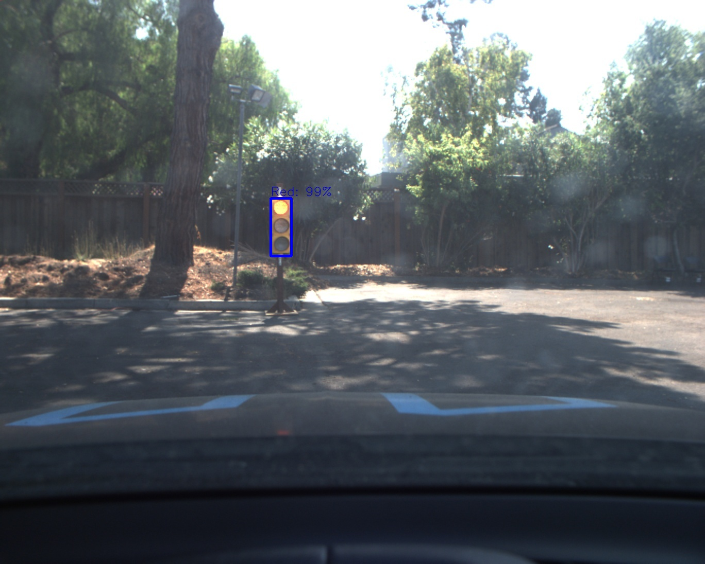
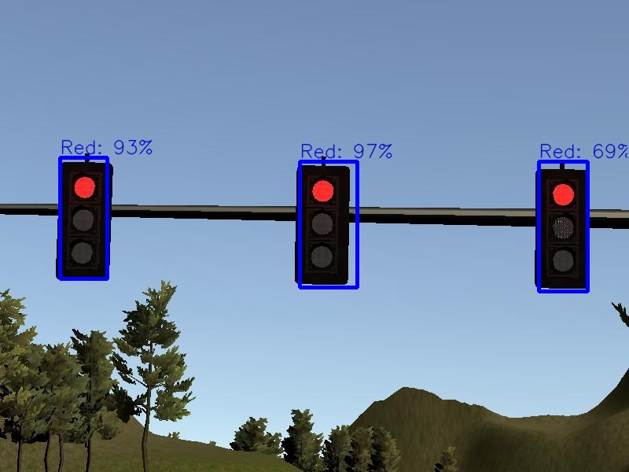
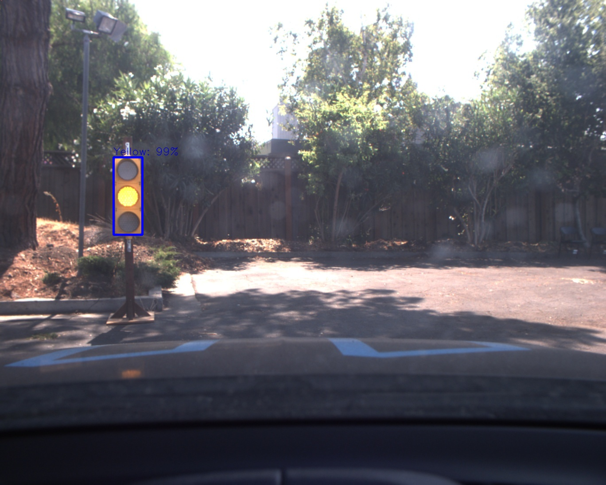
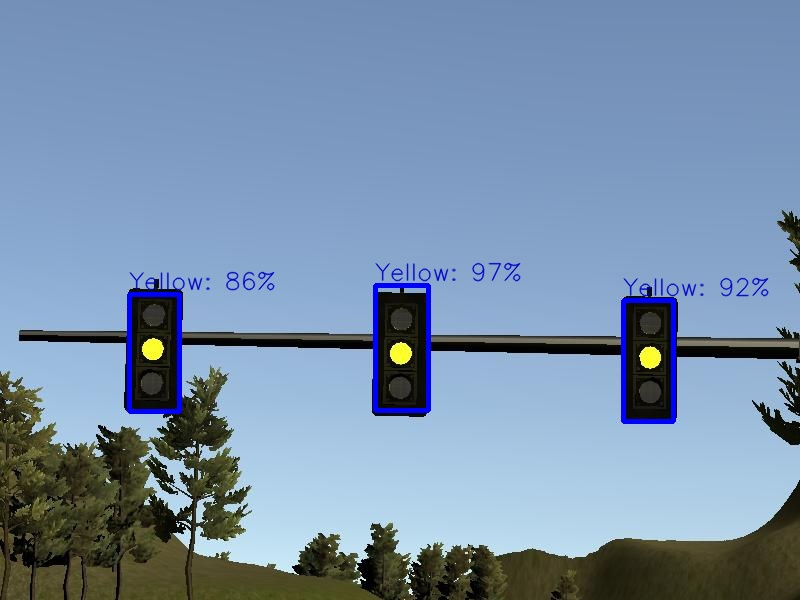
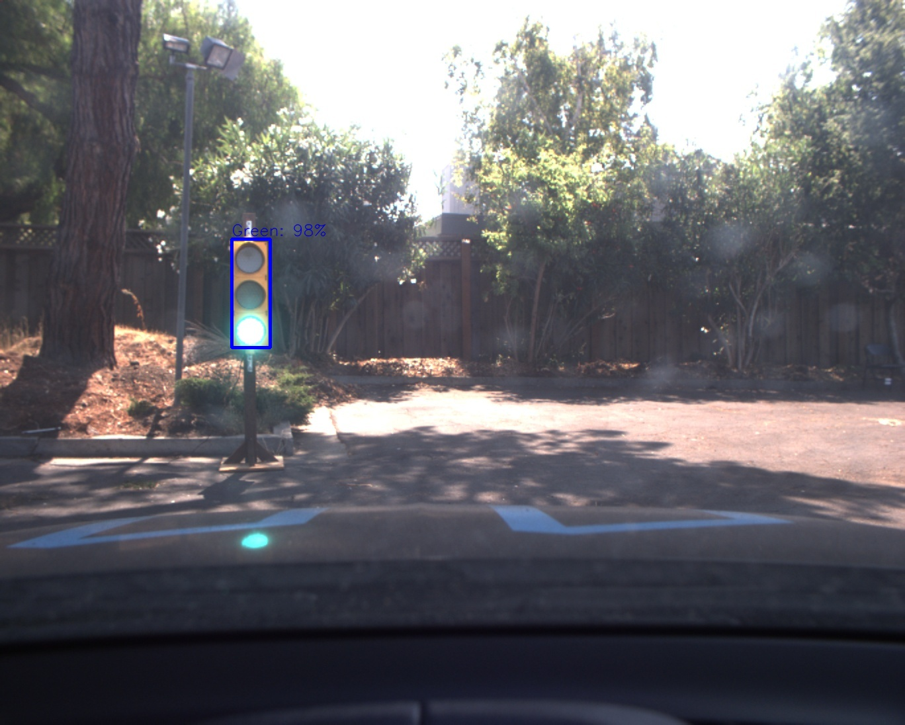

[//]: # (Image References)

[architecture]: ./output_images/final-project-ros-graph-v2.png "Architecture"
[tldetector]: ./output_images/tl-detector-ros-graph.png "TL Detector"
[waypoint]: ./output_images/waypoint-updater-ros-graph.png "Waypoint Updater"
[dbw]: ./output_images/dbw-node-ros-graph.png "Drive-By-Wire"
[simulator]: ./output_images/simulator.png "Simulator"
[sim]: ./output_images/sim.gif "Simulation"
[real]: ./output_images/real.gif "Real"

# **Capstone Project** 
## Report

---

**Capstone Project**
![alt text][simulator]
# Overview
This repository contains all the code needed to run the project for the System Integration course in Udacity's Self-Driving Car Nanodegree.

## Project Introduction
This is the project repo for the final project of the Udacity Self-Driving Car Nanodegree: Programming a Real Self-Driving Car. For more information about the project, see the project introduction [here](https://classroom.udacity.com/nanodegrees/nd013/parts/6047fe34-d93c-4f50-8336-b70ef10cb4b2/modules/e1a23b06-329a-4684-a717-ad476f0d8dff/lessons/462c933d-9f24-42d3-8bdc-a08a5fc866e4/concepts/5ab4b122-83e6-436d-850f-9f4d26627fd9).

## Prerequisites
This project involves the System Integration Simulator which contains the Capstone Project from the [releases tab](https://github.com/udacity/CarND-Capstone/releases).

## Running the Code
* Simulator. You can download these from the [project intro page](https://github.com/udacity/CarND-Capstone/releases) in the classroom.


Please refer to [Usage](###Usage) in order to run the project.

# Introduction
Carla uses waypoint navigation to drive on autonomously while avoiding obstacles and detecting/classifying traffic lights to stop at given stoplines' indices. Waypoints are used by Carla to do its path planning. Each waypoint has a target velocity based on the vehicle's intended behavior. The Carla's system consists of 3 main modules.

1. **Perception**
   
    a. Traffic Light Detection/Classification

    b. Obstacle Detection

2. **Planning**
   
   Waypoint Updater and the associated target velocities

3. **Control**

   Drive-By-Wire Node / Twist Controller: Controlling the vehicle's behaviour by actuating throttle, steering and brake to navigate the waypoints with the target velocity.

An overview of the complete system architecture is shown below

![alt text][architecture]
    
## Perception

### Traffic Light Detection / Classification
![alt text][tldetector]

|Topic | Info |
|--- | --- |
|/traffic_waypoint | index of the waypoint for nearest upcoming red light's stop line|
|/current_pose| Provides the current position|
|/base_waypoints| list of waypoints the car will be following|
|/image_color |image stream from the car's camera|
|/vehicle/traffic_lights | (x, y, z) coordinates of all traffic light|

This node is responsible for detecting upcoming traffic lights on the way, and classifying them based on their current state (red, yellow, green, unknown).

Tensorflow's [Object Detection API](https://github.com/tensorflow/models/tree/master/research/object_detection) was used to detect and classify the traffic lights in the images provided by the camera.

A seperate [repository](https://github.com/mhusseinsh/CarND-Traffic-Light-Detection) was set for such a task.

The Traffic Light dataset (extracted from the simulator or real data extracted from the provided [bag file](https://s3-us-west-1.amazonaws.com/udacity-selfdrivingcar/traffic_light_bag_file.zip)). The data is already extracted, labelled and provided by [Anthony Sarkis](https://medium.com/@anthony_sarkis), thanks to him!.

Examples
|                | Real Data                             | Sim Data                               | 
| -------------- | --------------------------------------- | ------------------------------------------- |
| Red Light |  |  |
| Yellow Light |  |  |
| Green Light |  |  |

## Planning

### Waypoint Updater
![alt text][waypoint]
|Topic | Info |Type|
|--- | --- |--|
|/final_waypoint |list of waypoints ahead of the car with target velocities |styx_msgs/Lane|
|/obstacle_waypoint |  location to stop for obstacle|
|/traffic_waypoint | location to stop for red light|
|/current_pose| Provides the current position| geometry_msgs/PoseStamped|
|/base_waypoints| list of waypoints the car will be following provided by a static .csv file|	styx_msgs/Lane |

The purpose of this node is to update the associated target velocity of each waypoint defined in the whole waypoints list based on the state of the upcoming traffic light and the obstacle detection (which is not implemented). This node will subscribe to the /base_waypoints, /current_pose, /obstacle_waypoint, and /traffic_waypoint topics, and publishes in the end a list of waypoints ahead of the vehicle with associated velocites to /final_wayponts topic.

## Control

### Drive-By-Wire Node / Twist Controller
![alt text][dbw]
|Topic | Info |
|--- | --- |
|/current_velocity and /twist_cmd| target linear and angular velocity|
|/vehicle/dbw_enabled| car control under dbw or manual|

The purpose of this node to calculate the throttle, brake and steering commands and publish them to the vehicle.

#### Drive-By-Wire Node
Carla is equipped with a drive-by-wire (dbw) system, meaning the throttle, brake, and steering have electronic control. The dbw_node subscribes to the /current_velocity topic along with the /twist_cmd topic to receive target linear and angular velocities. Additionally, this node will subscribe to /vehicle/dbw_enabled, which indicates if the car is under dbw or driver control. This node will publish throttle, brake, and steering commands to the /vehicle/throttle_cmd, /vehicle/brake_cmd, and /vehicle/steering_cmd topics.

#### Twist Controller
The controller's main task is to control acceleration and steering values. The acceleration is controlled via a [PID Controller](https://github.com/mhusseinsh/CarND-Capstone/blob/master/ros/src/twist_controller/pid.py), while the steering is calculated via a [Yaw Controller](https://github.com/mhusseinsh/CarND-Capstone/blob/master/ros/src/twist_controller/yaw_controller.py) which calculates the needed angle to maintain the required velocity.

# Results Evaluation and Success Criteria

Based on the defined [Rubric Points](https://review.udacity.com/#!/rubrics/3058/view) the Capstone Project should achieve the below points:

1. **The code is built successfully and connects to the simulator.**: By running `catkin_make`, `source devel/setup.sh` and `roslaunch launch/styx.launch` within the ros directory results in no errors and allows the program to connect to the simulator

2. **Waypoints are published to plan Carla’s route around the track.**: Waypoints are published to `/final_waypoints` to plan the vehicle’s path around the track. No unnecessary moves (excessive lane changes, unnecessary turning, unprompted stops) are occurring. As in the Path Planning project, acceleration does not exceed 10 m/s^2 and jerk should not exceed 10 m/s^3.

3. **Controller commands are published to operate Carla’s throttle, brake, and steering.**: `dbw_node.py` has been implemented to calculate and provide appropriate throttle, brake, and steering commands. The commands are published to `/vehicle/throttle_cmd`, `/vehicle/brake_cmd` and `/vehicle/steering_cmd`, as applicable.
   
4. **Successfully navigate the full track more than once.**: The vehicle is able to complete more than one full loop of the track without running off road or any other navigational issues (incorrect turns, random stops, teleportation, etc.).
   
The system was tested on the simulator as well as real data provided by the given [bag file](https://s3-us-west-1.amazonaws.com/udacity-selfdrivingcar/traffic_light_bag_file.zip) to check the performance, and below are the results on both domains.

## Simulation

![alt text][sim]

## Real Data

![alt text][real]

# Further README
## Installation

Please use **one** of the two installation options, either native **or** docker installation.

### Native Installation

* Be sure that your workstation is running Ubuntu 16.04 Xenial Xerus or Ubuntu 14.04 Trusty Tahir. [Ubuntu downloads can be found here](https://www.ubuntu.com/download/desktop).
* If using a Virtual Machine to install Ubuntu, use the following configuration as minimum:
  * 2 CPU
  * 2 GB system memory
  * 25 GB of free hard drive space

  The Udacity provided virtual machine has ROS and Dataspeed DBW already installed, so you can skip the next two steps if you are using this.

* Follow these instructions to install ROS
  * [ROS Kinetic](http://wiki.ros.org/kinetic/Installation/Ubuntu) if you have Ubuntu 16.04.
  * [ROS Indigo](http://wiki.ros.org/indigo/Installation/Ubuntu) if you have Ubuntu 14.04.
* Download the [Udacity Simulator](https://github.com/udacity/CarND-Capstone/releases).

### Docker Installation
[Install Docker](https://docs.docker.com/engine/installation/)

Build the docker container
```bash
docker build . -t capstone
```

Run the docker file
```bash
docker run -p 4567:4567 -v $PWD:/capstone -v /tmp/log:/root/.ros/ --rm -it capstone
```

### Port Forwarding
To set up port forwarding, please refer to the "uWebSocketIO Starter Guide" found in the classroom (see Extended Kalman Filter Project lesson).

### Usage

1. Clone the project repository
```bash
git clone https://github.com/udacity/CarND-Capstone.git
```

2. Install python dependencies
```bash
cd CarND-Capstone
pip install -r requirements.txt
```
3. Make and run styx
```bash
cd ros
catkin_make
source devel/setup.sh
roslaunch launch/styx.launch
```
4. Run the simulator

### Real world testing
1. Download [training bag](https://s3-us-west-1.amazonaws.com/udacity-selfdrivingcar/traffic_light_bag_file.zip) that was recorded on the Udacity self-driving car.
2. Unzip the file
```bash
unzip traffic_light_bag_file.zip
```
3. Play the bag file
```bash
rosbag play -l traffic_light_bag_file/traffic_light_training.bag
```
4. Launch your project in site mode
```bash
cd CarND-Capstone/ros
roslaunch launch/site.launch
```
5. Confirm that traffic light detection works on real life images

### Other library/driver information
Outside of `requirements.txt`, here is information on other driver/library versions used in the simulator and Carla:

Specific to these libraries, the simulator grader and Carla use the following:

|        | Simulator | Carla  |
| :-----------: |:-------------:| :-----:|
| Nvidia driver | 384.130 | 384.130 |
| CUDA | 8.0.61 | 8.0.61 |
| cuDNN | 6.0.21 | 6.0.21 |
| TensorRT | N/A | N/A |
| OpenCV | 3.2.0-dev | 2.4.8 |
| OpenMP | N/A | N/A |

We are working on a fix to line up the OpenCV versions between the two.
